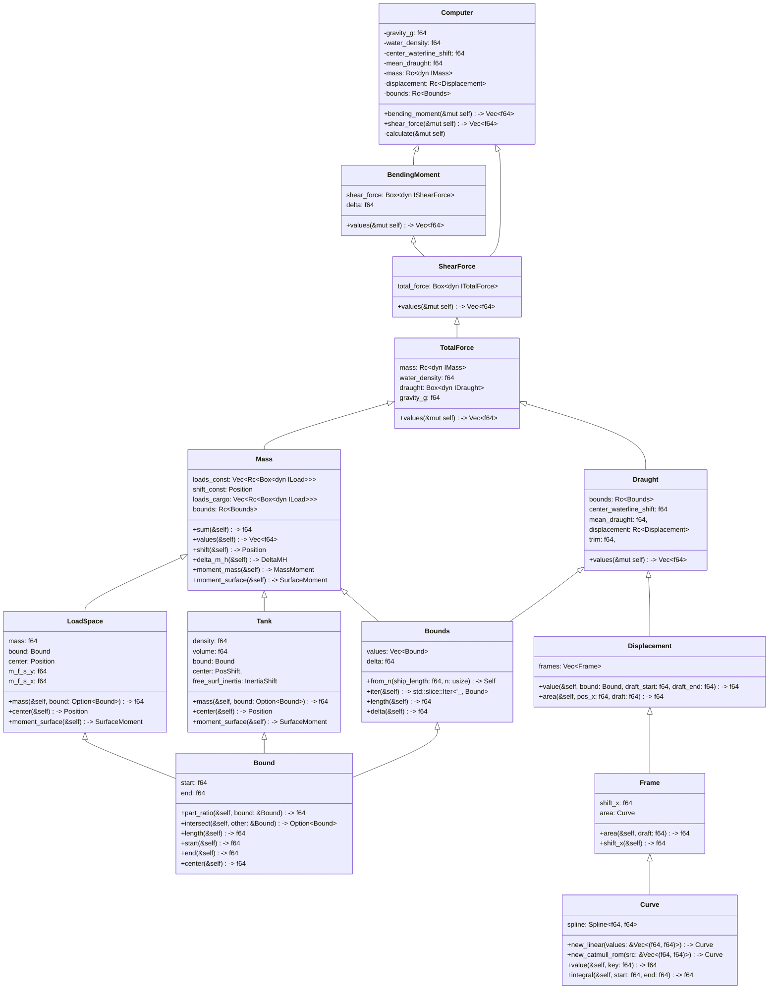

# sss-computing-strength

sss-computing-strength

Расчет изгибающих моментов и срезывающих сил при общем изгибе корпуса судна на тихой воде.
Подробности расчетов приведены в /design/Статище.
Входные данные:  

- n_parts: количество отрезков разбиения корпуса судна по х,
- water_density: плотность воды,
- center_waterline: кривая отстояния центра тяжести ватерлинии по длине от миделя,
- rad_long: кривая продольного метацентрического радиуса,
- rad_cross: кривая поперечного метацентрического радиуса,
- mean_draught: кривая средней осадки,
- center_draught_shift: кривая отстояния центра величины погруженной части судна,
- массив шпангоутов судна [(index, immersion_area)], где:
  - index: порядковый номер шпангоута,
  - immersion_area: кривая погружаемой площади,
- load_constant: постоянный груз, приходящийся на шпацию
- load_spaces: массив данных по твердым грузам в составе:
  - mass: общая масса груза,
  - bound: границы груза,
  - center: центер масс;
- tanks: массив данных по цистернам в составе:
  - density: плотность жидкости в цистерне,
  - volume: объем жидкости в цистерне,
  - bound: границы цистерны, (x1, x2),
  - center: кривая координат центра объема жидкости в цистерне
         в системе координат судна (volume, x, y, z),
  - free_surf_inertia: кривая момента инерции площади свободной  
         поверхности жидкости (volume, x - поперечный, y - продольный).
   Выходные данные:
- массив значений срезывающих сил,
- массив значений изгибающих моментов,
(TODO: выходные данные для расчета остойчивости)

   Общее описание и порядок расчетов для прочности:

   1. Вычисляется общая масса судна путем суммирования всех нагрузок. Из общей массы по кривой водоизмещения с учетом плотности воды вычисляется объемное водоизмещение $\nabla = \Delta/\rho$.
   2. Перебираются значения дифферента, для этого дифферента выполняются следующие расчеты постепенно приближаясь к нулевому значению изгибающего момента на последней шпации.  
   3. Из дифферента и средней осадки вычисляется осадка носа и кормы. Из них методом линейной интерполяции вычисляется распределение осадки по каждой шпации.
   4. Вычисляется вытесненную массу воды для каждой шпации. Погруженная площадь $S_{start}, S_{end}$ теоретических шпангоутов берется из кривых. $L_{start}, L_{end}$ - расстояние от кормы до шпангоутов, ограничивающих шпацию. Вытесненная масса воды Buoyancy вычисляется как среднее значение погруженной площади умноженное на плотность воды $\gamma$ и на разницу расстояний до теоретических шпангоутов:  
      $V_i = \frac{(S_{start_i} + S_{end_i})}{2}*(L_{end_i}-L_{start_i})*\gamma$
   5. Вычисляется результирующая сила TotalForce для каждой шпации как разницу веса вытесненной воды и массы приходящейся на каждую шпацию, умноженную на гравитационную постоянную g:  
      $Ft_i = (m_i - V_i)*g$.
   6. Вычисляется срезающуя сила ShearForce для каждой шпации через интегрирование. Интегрирование проводим путем вычисления суммы сверху:  
      $Fs_i = Fs_{i-1} + Ft_i, Fs_0 = 0$.
   7. Вычисляется изгибающий момент BendingMoment для каждой шпации как интегральнуа  сумма срезающей силы:  
      $M_i = \left(M_{i-1} + Fs_{i-1} + Fs_i \right)*\frac{\Delta L}{2}, M_0 = 0$.

   Общее описание и порядок расчетов для остойчивости:  

   1. Вычисляется общая масса судна путем суммирования всех нагрузок. Из общей массы по кривой водоизмещения с учетом плотности воды вычисляется объемное водоизмещение $\nabla = \Delta/\rho$.
   2. Исходя из объемного водоизмещения по таблицам элементов теоретического чертежа судна на ровный киль определяются:
      - отстояние центра величины погруженной части судна:
         - по длине от миделя $x_c$;
         - по ширине от ДП $y_c$;
         - по высоте от ОП $z_c$.
      - отстояние центра тяжести ватерлинии по длине от миделя $x_f$;
      - поперечный $r$ и продольный $R$ метацентрические радиусы, м;
      - среднюю осадку $d$;
   Для промежуточных значений определяется линейной интерполяцией. С учетом поправки на влияние свободной поверхности жидкости в цистернах вычисляется дифферент судна.
