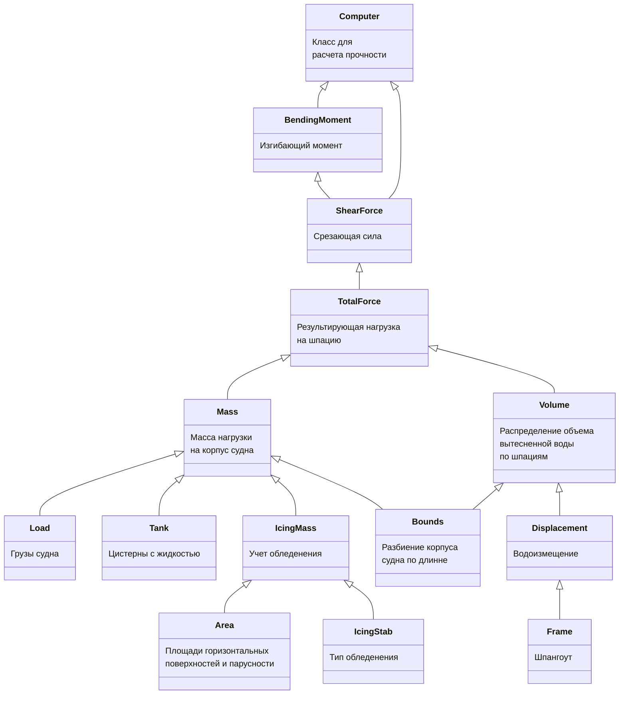

# sss-computing-strength

sss-computing-strength

Расчет изгибающих моментов и срезывающих сил при общем изгибе корпуса судна на тихой воде.
Подробности расчетов приведены в /design/Алгоритм расчета
Входные данные:  

   Общее описание и порядок расчетов для прочности:

   1. Вычисляется общая масса судна путем суммирования всех нагрузок c учетом обледенения. Из общей массы по кривой водоизмещения с учетом плотности воды вычисляется объемное водоизмещение $\nabla = \Delta/\rho$.
   2. Перебираются значения дифферента, для этого дифферента выполняются следующие расчеты постепенно приближаясь к нулевому значению изгибающего момента на последней шпации.  
   3. Из дифферента и средней осадки вычисляется осадка носа и кормы. Из них методом линейной интерполяции вычисляется распределение осадки по каждой шпации.
   4. Вычисляется вытесненную массу воды для каждой шпации. Погруженная площадь $S_{start}, S_{end}$ теоретических шпангоутов берется из кривых. $L_{start}, L_{end}$ - расстояние от кормы до шпангоутов, ограничивающих шпацию. Вытесненная масса воды Buoyancy вычисляется как среднее значение погруженной площади умноженное на плотность воды $\gamma$ и на разницу расстояний до теоретических шпангоутов:  
      $V_i = \frac{(S_{start_i} + S_{end_i})}{2}*(L_{end_i}-L_{start_i})*\gamma$
   5. Вычисляется результирующая сила TotalForce для каждой шпации как разницу веса вытесненной воды и массы приходящейся на каждую шпацию, умноженную на гравитационную постоянную g:  
      $Ft_i = (m_i - V_i)*g$.
   6. Вычисляется срезающуя сила ShearForce для каждой шпации через интегрирование. Интегрирование проводим путем вычисления суммы сверху:  
      $Fs_i = Fs_{i-1} + Ft_i, Fs_0 = 0$.
   7. Вычисляется изгибающий момент BendingMoment для каждой шпации как интегральнуа  сумма срезающей силы:  
      $M_i = \left(M_{i-1} + Fs_{i-1} + Fs_i \right)*\frac{\Delta L}{2}, M_0 = 0$.

   Общее описание и порядок расчетов для остойчивости:  

   1. Вычисляется общая масса судна путем суммирования всех нагрузок c учетом обледенения.  
   Из общей массы по кривой водоизмещения с учетом плотности воды вычисляется средняя осадка.
   2. С учетом обледенения и средней осадки вычисляется площадь парусности судна.
   3. Вычисляется статическое давление ветра и момент от смещения центра масс.
   4. Строится диаграммы остойчивости.
   5. Рассчитываются параметры остойчивости.
   6. Для заданного типа судна и условий плавания выбираются и проверяются критерии остойчивости.

