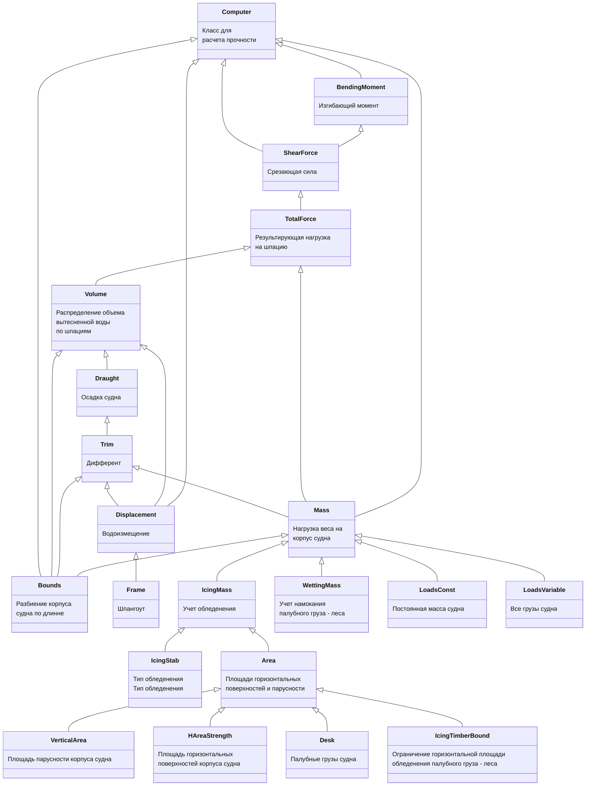
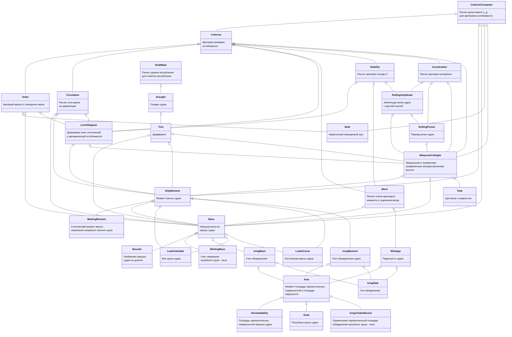

# sss-computing-strength

sss-computing-strength

Создать и открыть документацию:
cargo doc --no-deps --open  

Расчет изгибающих моментов и срезывающих сил при общем изгибе корпуса судна на тихой воде.

   Общее описание и порядок расчетов для прочности:

   1. Вычисляется общая масса судна путем суммирования всех нагрузок c учетом обледенения. Из общей массы вычисляется объемное водоизмещение.
   2. Перебираются значения осадки и дифферента удовлетворяющие условию совпадения массы судна с массой вытесненной воды и  
   смещения центра тяжести судна со смещением центра объема вытесненной воды.
   3. Из дифферента и средней осадки вычисляется осадка носа и кормы. Из них методом линейной интерполяции вычисляется распределение осадки по каждой шпации.
   4. Вычисляется вытесненная масса воды для каждой шпации.
   5. Вычисляется результирующая сила для каждой шпации как разница веса вытесненной воды и силы тяжести, приходящейся на каждую шпацию.
   6. Вычисляется срезающуя сила ShearForce для каждой шпации через интегрирование. Интегрирование проводим путем вычисления суммы сверху.
   7. Вычисляется изгибающий момент BendingMoment для каждой шпации как интегральнуа  сумма срезающей силы.
  

   Общее описание и порядок расчетов для остойчивости:  

   1. Вычисляется общая масса судна путем суммирования всех нагрузок c учетом обледенения.  
    Из общей массы по кривой водоизмещения с учетом плотности воды вычисляется средняя осадка.
   2. С учетом обледенения и средней осадки вычисляется площадь парусности судна.
   3. Вычисляется статическое давление ветра и момент от смещения центра масс.
   4. Строится диаграммы остойчивости.
   5. Рассчитываются параметры остойчивости.
   6. Для заданного типа судна и условий плавания выбираются и проверяются критерии остойчивости.

